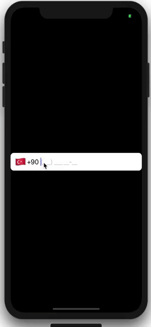

# React-Native-INTL-Phone-Input
It's an international phone input with phone mask. 




# USAGE

install npm library
```
npm install react-native-intl-phone-input
```


İmport library
```
import IntlPhoneInput from 'react-native-intl-phone-input';
```
use component
```
  onChangeText = ({dialCode, unmaskedPhoneNumber, phoneNumber, isVerified}) => {
    console.log(dialCode, unmaskedPhoneNumber, phoneNumber, isVerified);
  };
  render() {
    return (
      <SafeAreaView>
        <IntlPhoneInput onChangeText={this.onChangeText} defaultCountry="TR" renderAction={() => <Text>XX</Text>} />
      </SafeAreaView>
    );
  }
```


Custom Modal Example
```
 renderCustomModal=(modalVisible, countries, onCountryChange) => (
    <Modal visible={modalVisible}>
      <SafeAreaView style={{ flex: 1 }}>
        <View>
          <View>
            <TextInput placeholder="Search" />
            <Text>🔍</Text>
          </View>
          <FlatList
            style={{ flex: 1 }}
            data={countries}
            keyExtractor={(item, index) => index.toString()}
            renderItem={({ item }) => (
              <TouchableWithoutFeedback onPress={() => onCountryChange(item.code)}>
                <Text>{item['your language code here for example tr']}</Text>
              </TouchableWithoutFeedback>
            )}
          />
        </View>
        <TouchableOpacity onPress={() => this.phoneInput.hideModal()}>
          <Text>CLOSE</Text>
        </TouchableOpacity>
      </SafeAreaView>
    </Modal>
  )

  render(){
    return <IntlPhoneInput
        ref={(ref) => this.phoneInput = ref}
        customModal={this.renderCustomModal}
        defaultCountry="TR"
        lang="TR"
      />;
  }

```


Supported Languages |  |
--- | --- |
TR | Turkish |
LT | Lithuanian |
EN | English |
RU | Russian |


prop names |type |default value | comment 
--- | --- | --- | --- 
lang | String |  | Translate country name on modal
placeholder | String |  | This prop change the phone input placeholder
defaultCountry | String | TR | You can change your default country code 
mask | String |  | You can set custom mask
onChangeText | Function |  | This function works when input text is changed 
customModal | Function |  | Generate your custom modal
phoneInputStyle | Style |  | This prop is about the text field's ReactNative.TextInput style 
containerStyle | Style |  | This prop is about the text field's container style 
dialCodeTextStyle | Style |  |  
flagStyle | Style |  |  
modalContainer | Style |  | This prop is about the modal field's SafeAreaView style.
filterInputStyle | Style |  | This prop is about the top of model filter text style 
closeButtonStyle | Style |  | This prop is about text style of bottom modal
modalCountryItemCountryNameStyle | Style |  |  
filterText | String | Filter | This is the text of placeholder input of top modal 
closeText | String | CLOSE | This prop is about the text of bottom modal 
disableCountryChange | Bool | false | This prop is about disable open select country modal
renderAction | Function |  | This prop attaching a component right of phone input
placeholderTextColor | String | black | This prop allows you to assign a color to the placeholderText

